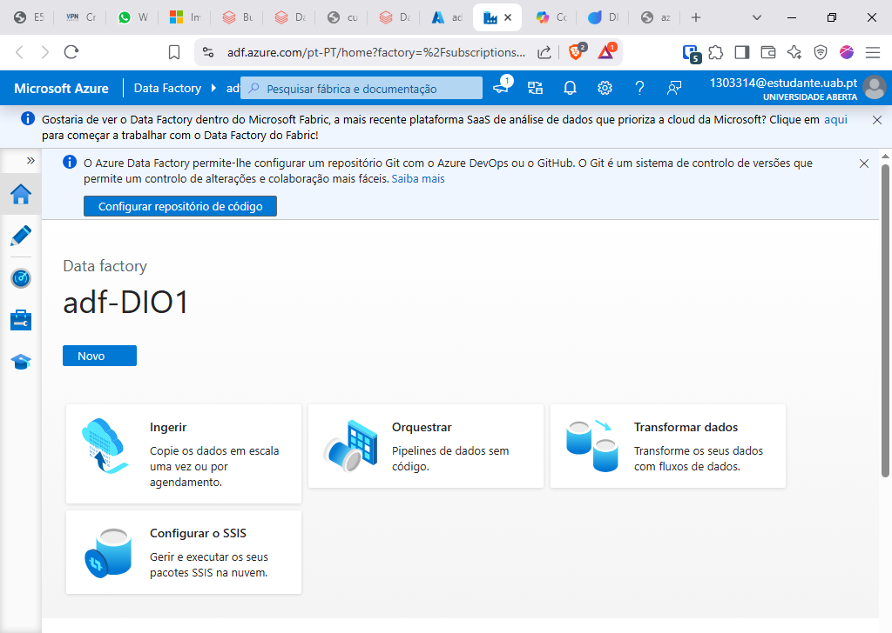
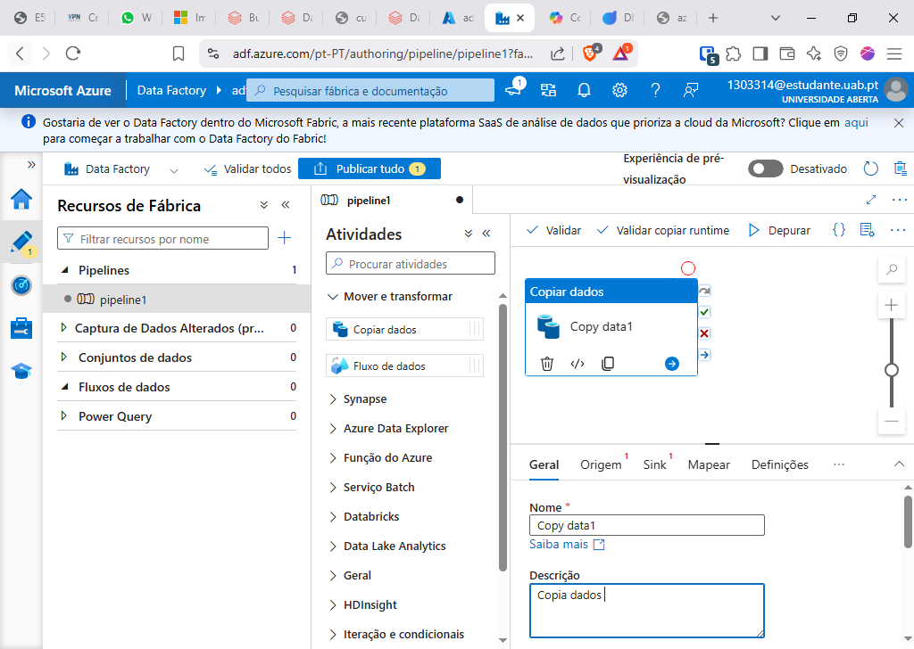

# DIO-adf-pipeline
 Exercise of DIO Azure Data Bricks Bootcamp

# Introdução
O Azure Data Factory( adf), realiza operações de ETL de múltiplas fontes, centralizando e orquestrando a coleta de dados, trazendo confiança para todo processo.

Tendo o nosso Data factory criado devemos ir ao Data Factory Studio:

#  Pipeline

os Pipeline descrevem os fluxo de dados( DataFlows) em Atividade( Activites), onde uma atividade realiza uma operação de coleta ou transformação de dados.

#Activites
Existem vários tipos de atividade disponíveis nos pipelines do adf, citando alguns exemplos:

- Copy Data

É responsável por copiar os dados de uma fonte( Linked service) para outra.
- Filter
 Filtra dados por parâmetros definidos.
- Append Variable
 Adiciona um valor a um Array existente.
- For Each

 Pecorre uma coleção, repete uma DataFlow em um pipeline.
-Outros...

# Integration Runtime e Linked service.

O Integration Runtime( IR) determina os locais onde podem se encontrar os Linked service.

Existem três tipos de Integration Runtime: Azure, Self-hosted, Azure-SSIS.

No Integration Runtime Self-hosted, é necessário instalar o cliente na máquina local que tem acesso ao serviço, como exemplo o SQL server. Existe a opção express onde é feito a configuração automática ou a manual que é necessário introduzir informação com keys no client do Runtime.

-Linked service
Está é a parte onde definimos o acesso com as credencias inclusive, das origem e destinos dos dados que serão operamos no nosso DataFlow.

No caso de um MySQL Server local, utilizamos o IR Self-hosted.
